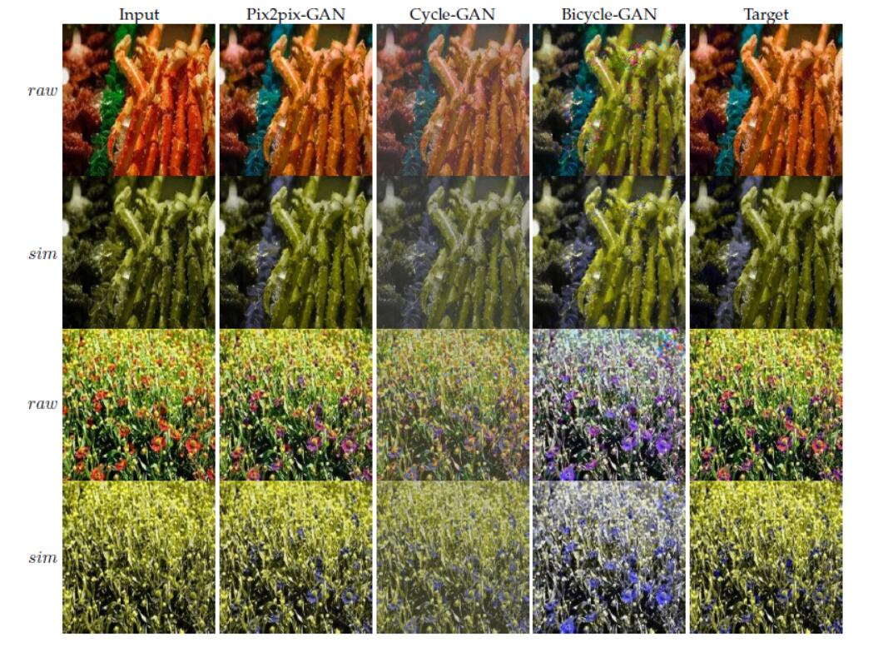

# Color Vision Deficiency Datasets & Recoloring Evaluation using GANs 


## Setup

### Prerequisites
- Linux or OSX
- NVIDIA GPU + CUDA CuDNN (CPU mode and CUDA without CuDNN may work with minimal modification, but untested)

### Getting Started
- Install torch and dependencies from https://github.com/torch/distro
- Install torch packages `nngraph` and `display`
```bash
luarocks install nngraph
luarocks install https://raw.githubusercontent.com/szym/display/master/display-scm-0.rockspec
```
- Clone this repo:
```bash
git clone https://github.com/doubletry/pix2pix.git
cd pix2pix
```
- Download and unzip the dataset.zip to the datasets folder (https://pan.baidu.com/s/1rCJt8yVkkfunlvU54Qxn_g) or run this:
```bash
bash ./scripts/download_dataset.sh
```


- Download and unzip the pix2pix model to the checkpoints folder (https://pan.baidu.com/s/13hYCNxQqs-xNjgkuK1T7Uw)
- Combine the images:
```bash
python scripts/combine_A_and_B.py --fold_A ./datasets/colourblindness/A/ --fold_B ./datasets/colourblindness/B --fold_AB ./datasets/colourblindness/
```


- Test the model:
```bash
bash ./test_model.sh
```
The test results will be saved to an html file here: `./results/colourblindness/latest_net_G_val/index.html`.


## Citation
If you use this code for your research, please cite our paper <a href="https://arxiv.org/pdf/1611.07004v1.pdf">Image-to-Image Translation Using Conditional Adversarial Networks</a>:

```
@article{pix2pix2017,
  title={Image-to-Image Translation with Conditional Adversarial Networks},
  author={Isola, Phillip and Zhu, Jun-Yan and Zhou, Tinghui and Efros, Alexei A},
  journal={CVPR},
  year={2017}
}
```


## Acknowledgments
Code borrows heavily from [DCGAN](https://github.com/soumith/dcgan.torch). The data loader is modified from [DCGAN](https://github.com/soumith/dcgan.torch) and  [Context-Encoder](https://github.com/pathak22/context-encoder).
